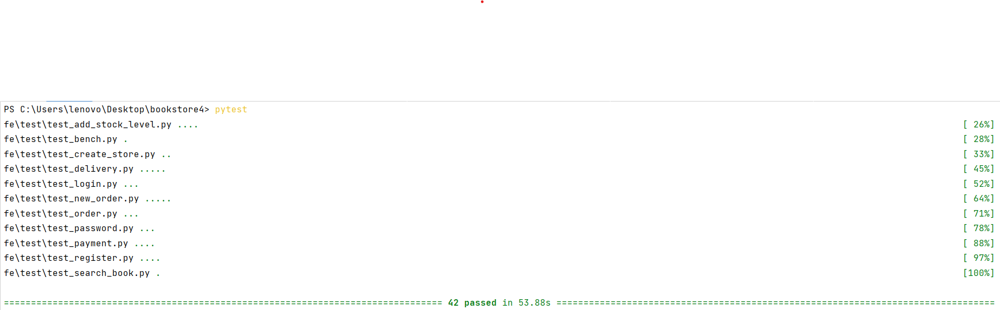
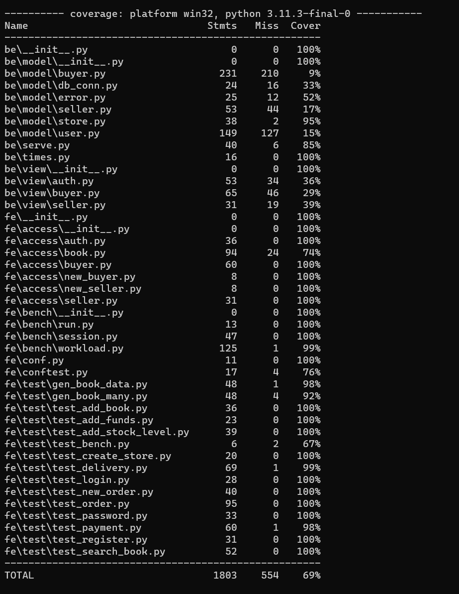

# BookStore Report

## Members
- 洪熠佳 520021910598
- 罗皓天 520030910325
- 蒋林希 520030910328
- 三人共同完成代码及报告

## DataBase Design
- user

|user_id|password|balance|token|terminal|
|---|---|---|---|---|

- store:

|store_id|stock_level|
|---|---|

- book:

|_id|id|title|author|publisher|originate_title|translator|pub_year|pages|price|currency_unit|binding|isbn|author_intro|book_intro|book_intro|content|tags|picture|
|---|---|---|---|---|---|---|---|---|---|---|---|---|---|---|---|---|---|---|

- user_store:

|user_id|store_id|
|---|---|

- new_order:

|order_id|user_id|store_id|
|---|---|---|

- new_order_detail:

| order_id |book_id|count|price|
|----------|---|---|---|


## Details
### Base 60%
Use pymongo to implement the backend logic (Only show the Important Parts)

- user.py
  - register

    Add a new info of user into the database "user"
    ```python
    new_user = {
        "user_id" : user_id,
        "password" : password,
        "balance" : 0,
        "token" : token,
        "terminal" : terminal 
        } 
    self.db['user'].insert_one(new_user)
    ```

  - check_password

    Find the password of the user in the database and check whether it matches 
    ```python
    result = self.db['user'].find_one({'user_id': user_id}, {'password':1})
    ```
  
  - login

    Invoke check_password to check the user's password and update the token in the database to store the timestamp of the time when the user login
    ```python
    result = self.db['user'].update_one({'user_id': user_id}, {'$set': {'token': token, 'terminal': terminal}})
    ```

  - logout

    Update the token in the database (dummy_token)

    If the duration has been more than 3,600 s, the user will logout automatically
    ```python
    result = self.db['user'].update_one({'user_id': user_id}, {'$set': {'token': dummy_token, 'terminal': terminal}})
    ```
  
  - unregister

    Delete the infomation of the user from the database
    ```python
    result = self.db['user'].delete_one({'user_id': user_id})
    ```
  
  - change_password

    Fisrt, invoke check_password to check the user's password and then updata the new password in the database
    ```python
    result = self.db['user'].update_one({'user_id': user_id}, {'$set': {'password': new_password, 'token': token, 'terminal': terminal}})
    ```

- buyer.py
  - new_order

    Fisrt, check the whether the bookstore and the book exist

    Then, check the stock_level of the book

    Update the new stock_level and create a new order in the database
  

    ```python
    order = {
      "order_id" : uid,
      "store_id" : store_id,
      "user_id" : user_id,
      "status" : 0,
      "create_time" : datetime.datetime.now()
    }
    self.db['new_order'].insert_one(order)
    ```
  - payment
    
    First, cheak the user's password and the order id

    Then check the balance of the user

    If the balance is enough, then update the status of order to paid and the new balance of the user in the database.

    ```python
    // some code
    
    bookresult = self.db['store'].update_one({'store_id': store_id, 'book_id': book_id}, {'$inc': {'stock_level': count}})
    
    // some code
    
    result = self.db['user'].update_one({'user_id': buyer_id, 'balance': {'$gte': total_price}}, {'$inc': {'balance': -total_price}})
    if result.modified_count == 0:
        return error.error_not_sufficient_funds(order_id)
    
    result = self.db['user'].update_one({'user_id': seller_id}, {'$inc': {'balance': total_price}})
    if result.modified_count == 0:
        return error.error_non_exist_user_id(seller_id)
    
    result = self.db['new_order'].update_one({'order_id': order_id}, {'$set': {'status': 1}})
    if result.modified_count == 0:
        return error.error_invalid_order_id(order_id)
    
    ```

  - add_funds

    First, cheak the password of the user. Then update the balance.
    ```python
    order = {
      "order_id" : uid,
      "store_id" : store_id,
      "user_id" : user_id,
      "status" : 0,
      "create_time" : datetime.datetime.now()
    }
    self.db['new_order'].insert_one(order)
    ```

- seller.py
  - add_book

    Check the store_id and book_id and update the info of book in the database
    ```python
    new_book = {
      "store_id" : store_id,
      "book_id" : book_id,
      "book_info": book_json_str,
      "stock_level": stock_level
    }
    result = self.db['store'].insert_one(new_book)
    ```

  - add_stock_level

    Check the store_id and book_id and update the stock_level of book in the database
    ```python
    self.db['store'].update_one({'store_id': store_id, 'book_id': book_id}, {'$inc': {'stock_level': add_stock_level}})
    ```

  - create_store

    Check the store_id and add a new info of store in the database.
    ```python
    new_store = {
      "store_id" : store_id,
      "user_id" : user_id
    }
    self.db['user_store'].insert_one(new_store)
    ```

- store.py
  - init_tables_mongo

    Init the database (create the index)
    ```python
    def init_tables_mongo(self):
        try:
            user_col = self.db['user']
            user_col.create_index([("user_id", 1)], unique=True)
    
            user_store_col = self.db['user_store']
            user_store_col.create_index([("user_id", 1), ("store_id", 1)], unique=True)
    
            store_col = self.db['store']
            store_col.create_index([("store_id", 1), ("book_id", 1)], unique=True)
            store_col.create_index([("book_id", 1)])
    
            new_order_col = self.db['new_order']
            new_order_col.create_index([("order_id", 1)], unique=True)
    
            new_order_detail_col = self.db['new_order_detail']
            new_order_detail_col.create_index([("order_id", 1), ("book_id", 1)], unique=True)
    
        except pymongo.errors.PyMongoError as e:
            logging.error(e)
    ```
  
- db_coon.py

  Some utils to check whether the _id exists
  - user_id_exist && book_id_exist && store_id_exist
    ```python
      def user_id_exist(self, user_id):
          result = self.db['user'].find_one({'user_id': user_id})
          if result is None:
              return False
          else:
              return True
    
      def book_id_exist(self, store_id, book_id):
          result = self.db['store'].find_one({'store_id': store_id, 'book_id': book_id})
          if result is None:
              return False
          else:
              return True
    
      def store_id_exist(self, store_id):
          result = self.db['user_store'].find_one({'store_id': store_id})
          if result is None:
              return False
          else:
              return True
    ```

### Addition 40%
#### Delivery
- buyer.py
  - send_out_delivery
    
    First check the _order_id_ and _user_id_

    Then update the status of the order (status = 2)
    ```python
    result = self.db['new_order'].update_one({'order_id': order_id}, {'$set': {'status': 2}})
    if result.matched_count == 0:
        return error.error_invalid_order_id(order_id)
    ```

  - take_delivery

    First check the _order_id_ and _user_id_

    Then update the status of the order (status = 3)
    ```python
    result = self.db['new_order'].update_one({'order_id': order_id}, {'$set': {'status': 3}})
    if result.matched_count == 0:
        return error.error_invalid_order_id(order_id)
    ```

#### Search Book
- fe/access/book.py

  Create text index for search
  ```python
  self.bookCollection = DBConn().db['book']
  self.bookCollection.create_index(
    [("$**", TEXT)]
  )
  self.bookCollection.create_index([("id", 1)], unique=True)
  ```

- user.py
  - search_for_book
    ```python
    def search_for_book(self, user_id:str, target: str ,store_id: str = '-1') -> (int, str, list)
    ```

    If the value of _store_id_ is 1, we search in all stores.

    If the results of search is too large, we will return only 10 results once
    ```python
    result = self.db['book'].find({'$text':{'$search': target}},{'score':{'$meta':'textScore'},'id':1}).sort('score',pymongo.DESCENDING).skip(int(10*i)).limit(10)
    ```

#### Order Function
- buyer.py
  - order_cancel

    Cancle the order and update the information accroding to the status of order(paid or not paid)


  - order cancel automatically

    - be/server.py

      Check the order every 15 seconds (a short time to test easily)

      ```python
      scheduler = APScheduler()
      scheduler.add_job('regular_inspection', regular_inspection, trigger='interval', seconds=15)
      scheduler.start()
      ```

    - be/times.py
      A function to check the status of orders. If the order is not paid, then cancel the order automatically
      ```python
      def regular_inspection():
          b = Buyer()
          result = b.db['new_order'].find({'status': 0}, {'order_id':1, 'store_id':1, 'create_time':1})
          for row in result:
              order_id = row['order_id']
              duration = (datetime.datetime.now() - row['create_time']).total_seconds()
              if duration > b.duration_limit:
                  store_id = row['store_id']
                  booklist = b.db['new_order_detail'].find({'order_id': order_id}, {'book_id':1, 'count':1})
                  for row in booklist:
                      book_id = row['book_id']
                      count = row['count']
                      b.db['store'].update_one({'store_id': store_id, 'book_id': book_id}, {'$inc': {'stock_level': count}})
                  b.db['new_order'].update_one({'order_id': order_id}, {'$set': {'status': 4}})
      ```

    Check the duration: if the time is longer than the pre-defined value and the order is not paid, then cancel the order.

    ```python
    duration = (datetime.datetime.now() - order['create_time']).total_seconds()
    for row in booklist:
        book_id = row['book_id']
        count = row['count']
        if order['status'] <= 1 and duration > self.duration_limit:
            bookresult = self.db['store'].update_one({'store_id': store_id, 'book_id': book_id}, {'$inc': {'stock_level': count}})
            if bookresult.matched_count == 0:
                return 536, "invalid store_id and book_id", ""
        order_details.append(row)
    ```
  - order_query

    Search all order and show their status.


## Evaluations
### Base 60%



All 42 pass (contains our own tests) in 53.88s (contains 15s sleep for our own test)

### Additional 40%

For the additional function, we write three more test.py:
  - test_delivery.py

    First, create an order and test the delivery and take delivery.

    We test some unallowed behaviors
    - deliver before payment
    - take delivery before deliver
    - repeat deliver
    - repeat take delivery

  - test_search_book.py

    First, we create two book stores and add some books(a part of these books are same)

    We test the function search in one certain store and all stores.

  - test_order.py

    First, we create some orders.

    We test the delivery and take delivery. (For testing some unallowed behaviors)

    We test some unallowed behaviors
    - deliver before payment
    - auto cancel
    - deliver after cancel

    We test auto cancel by sleep 15s (a short time to test easily)

All our test programs have cover all the error number which we write. We also test some unallowed behaviors to ensure. So we believe our code coverage is high.

We use _coverage_ to test



Our total coverage is 69%


## Improvement
### Control Search Results with Weights
In function search_for_book(), we use text index and control search results with weights

Text search assigns a score to each document that contains the search term in the indexed fields. The score determines the relevance of a document to a given search query.

For a text index, the weight of an indexed field denotes the significance of the field relative to the other indexed fields in terms of the text search score.

For each indexed field in the document, MongoDB multiplies the number of matches by the weight and sums the results. Using this sum, MongoDB then calculates the score for the document.

```python
self.bookCollection = DBConn().db['book']
self.bookCollection.create_index(
    [("$**", TEXT)]
    ,
    weights={
        'title': 10,
        'author': 5,
        'publisher': 5,
        'original_title': 10,
        'translator': 5,
        'tags': 3
    }
)
```

### Access Control
We find that there do not exist some access control between the owner of the store and the buyers. 

Owing to the lack of access control, any user who knows the _store_id_ can modify the info of books, so we add access control in the backend.

```python
def is_my_store(self, user_id, store_id):
    result = self.db['user_store'].find_one({'user_id': user_id, 'store_id': store_id})
    if result is None:
        return False
    else:
        return True
```

And we will invoke this function to check access.

### Git
https://github.com/AegeanYan/DB_PJ1

Git and GitHub is used to manage the code version

